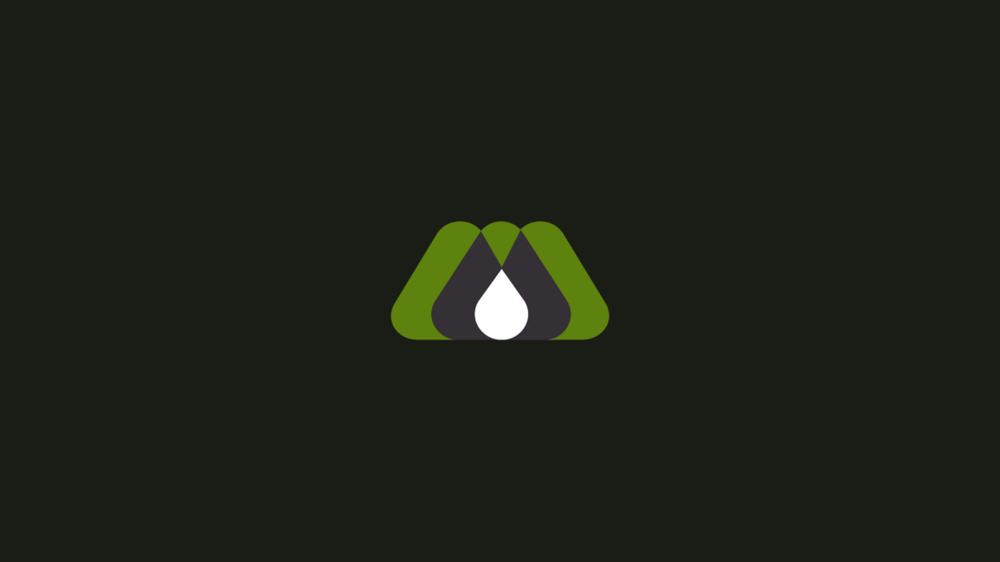

# MILC One Dark

Dark [Omarchy](https://omarchy.org/) theme from [MILC Group](https://milcgroup.com/) / [ONE](https://dev.milcgroup.com/) — charcoal olive `#1a1c16`, sage `#dee4d2`, olive `#5d820e`.

Pair: [light variant](https://github.com/dl-alexandre/omarchy-milc-one-theme)

## Install

```bash
omarchy theme install https://github.com/dl-alexandre/omarchy-milc-one-dark-theme.git
```

Or *Install > Style > Theme* and paste that URL.

About (fastfetch) and screensaver art live in the theme but Omarchy applies branding globally. After install, once per machine:

```bash
omarchy hook install theme-set ~/.config/omarchy/themes/milc-one-dark/theme-set-branding
omarchy theme set milc-one-dark
```

That copies the MILC mark into About, the TAAG “Milc Group” screensaver, and olive / charcoal / white fastfetch colors. Switching away restores your previous branding.

## Preview



## License

All rights reserved. Personal Omarchy use only; MILC Group / ONE marks stay with MILC Group.
